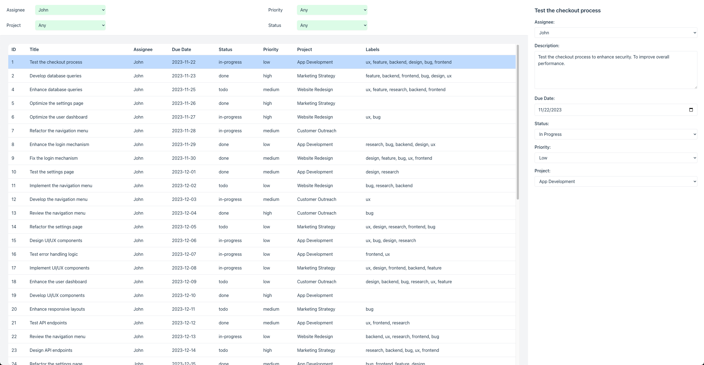

# Materialite Demo App Walkthrough

Think of Materialite as a database. A database that can efficiently respond to changes in data.

Think of the react demo application as an app where all state is stored in the database. Rather than ever using `useState` and `setState` we read and write state to/from the database.

> ⚠️ Note that we're still figuring out the best APIs to expose to developers and there are still bugs in Materialite.

## The Demo App

The demo app is a simple task tracking app. There's:

1. A table of tasks
2. A detail task view
3. A task filter

The state of each of these components is stored in the DB. Each of these components also subscribes to the DB so it can re-render itself when the data it is using from the DB changes. The demo is seeded with 1 million tasks.



## main.tsx

`main.tsx` is the component used to mount into the DOM. All it does is mount and render `TaskApp` into a DOM element.

```ts
ReactDOM.createRoot(document.getElementById("root")!).render(<TaskApp />);
```

## TaskApp.tsx

`TaskApp.tsx` is the root of our application. It:

1. Renders the child components: `TaskFilter`, `TaskTable`, and `TaskComponent`
2. Reads and writes task selection state

Task selection state is queried directly from our DB via a `useQuery` hook made to integrate Materialite with React.

```ts
const [, selectedTask] = useQuery(
  () =>
    db.appStates.stream
      .filter((s): s is Selected => s._tag === "selected")
      .materializeValue(null),
  []
);
```

Note the use of `db.appStates`.

`db` represents our "database" and `appStates` the collection / table of application state information. We'll go over the db abstraction after looking at how the selected task is written.
